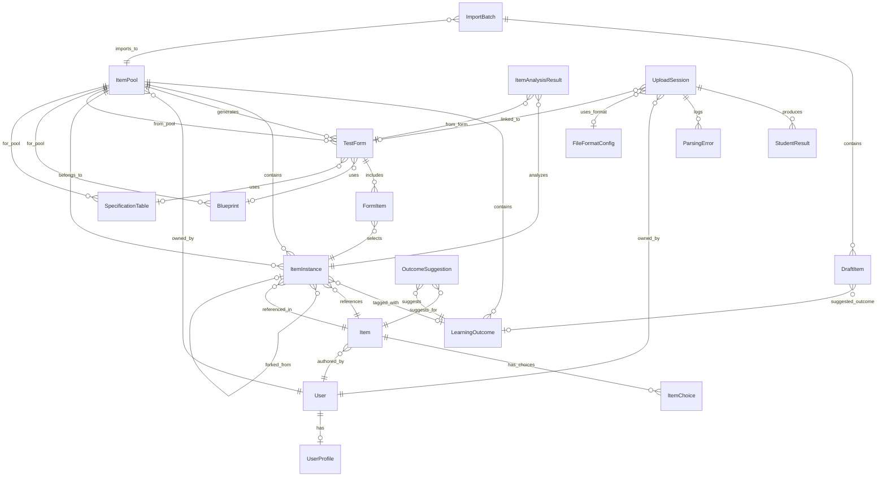
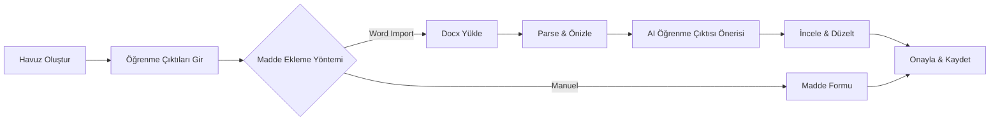
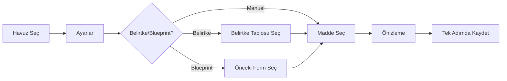
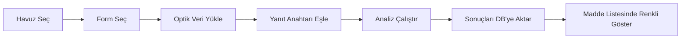

# Madde Havuzu ve Test Sistemi — Mimari Tasarım

> **Versiyon:** 1.0 (Planlama)
> **Temel alınan proje:** NefOptik — Django tabanlı optik form değerlendirme sistemi
> **Tarih:** 2026-03-03

---

## 1. Genel Bakış

```
┌──────────────────────────────────────────────────────────────────┐
│                    MADDE HAVUZU & TEST SİSTEMİ                   │
│  Django 4.2+ · DRF · PostgreSQL · Bootstrap 5 · Vanilla JS       │
├──────────────────────────────────────────────────────────────────┤
│                                                                  │
│  ┌─────────────┐  ┌─────────────┐  ┌─────────────────────────┐  │
│  │  itempool    │  │  grading    │  │  maddehavuzu (project)  │  │
│  │  (YENİ APP)  │  │ (MEVCUT)    │  │  settings, urls, wsgi   │  │
│  └──────┬──────┘  └──────┬──────┘  └─────────────────────────┘  │
│         │                │                                       │
│  ┌──────┴───────────────┴──────────────────────────────────┐    │
│  │                    Ortak Katmanlar                        │    │
│  │  • auth/permissions  • templates  • static  • utils      │    │
│  └──────────────────────────────────────────────────────────┘    │
└──────────────────────────────────────────────────────────────────┘
```

Sistem iki Django uygulaması üzerinde çalışır:

1. **`grading`** (NefOptik'ten devralınan): Optik form okuma, puanlama, istatistik hesaplama
2. **`itempool`** (yeni): Madde havuzu, test formu oluşturma, AI eşleme, analiz entegrasyonu

---

## 2. Modüler Yapı

```
MaddeHavuzu/
├── maddehavuzu/               # Django proje ayarları
│   ├── settings.py
│   ├── urls.py
│   ├── wsgi.py / asgi.py
│   └── __init__.py
│
├── grading/                   # [MEVCUT] Optik okuma & puanlama
│   ├── models/
│   │   ├── user_profile.py    # UserProfile + UserStatus (genişletilecek: +role)
│   │   ├── file_format.py     # FileFormatConfig
│   │   └── upload.py          # UploadSession, StudentResult, ParsingError
│   ├── services/
│   │   ├── parsing.py         # ParsingService (aynen korunacak)
│   │   ├── grading.py         # GradingService (aynen korunacak)
│   │   ├── statistics.py      # StatisticsService (genişletilecek)
│   │   ├── analysis.py        # CheatingAnalysisService (aynen korunacak)
│   │   └── export_xlsx.py     # Excel export (genişletilecek)
│   ├── parsers/
│   │   ├── base.py            # BaseParser
│   │   └── configurable.py    # ConfigurableParser
│   ├── views/                 # Mevcut view'lar korunacak
│   ├── templates/
│   └── tests/
│
├── itempool/                  # [YENİ] Madde havuzu sistemi
│   ├── models/
│   │   ├── __init__.py
│   │   ├── pool.py            # ItemPool, LearningOutcome
│   │   ├── item.py            # Item, ItemChoice, ItemInstance
│   │   ├── draft.py           # DraftItem, ImportBatch
│   │   ├── form.py            # TestForm, FormItem, Blueprint, SpecificationTable
│   │   ├── analysis.py        # ItemAnalysisResult, OutcomeSuggestion
│   │   └── audit.py           # ItemAuditLog, PoolPermission
│   ├── services/
│   │   ├── __init__.py
│   │   ├── import_docx.py     # Word import parser
│   │   ├── llm_client.py      # AI/LLM arayüzü
│   │   ├── outcome_suggestion.py  # Öğrenme çıktısı önerisi
│   │   ├── item_analysis.py   # Madde analizi ve risk skoru
│   │   ├── form_builder.py    # Form oluşturma servisi
│   │   └── form_generation.py # Blueprint/belirtke tabanlı madde seçimi
│   ├── serializers/           # DRF serializer'ları
│   ├── views/
│   │   ├── pool_views.py      # Havuz CRUD
│   │   ├── item_views.py      # Madde CRUD
│   │   ├── import_views.py    # Word import akışı
│   │   ├── form_views.py      # Test formu sihirbazı
│   │   ├── analysis_views.py  # Analiz paneli
│   │   └── api_views.py       # DRF API view'lar
│   ├── templates/itempool/
│   │   ├── pool_list.html
│   │   ├── pool_detail.html
│   │   ├── pool_form.html
│   │   ├── item_form.html
│   │   ├── item_detail.html
│   │   ├── import_upload.html
│   │   ├── import_preview.html
│   │   ├── form_wizard.html
│   │   ├── analysis_dashboard.html
│   │   └── partials/          # HTMX/partial template'ler
│   ├── static/itempool/
│   │   ├── css/
│   │   └── js/
│   ├── tests/
│   │   ├── test_models.py
│   │   ├── test_import_docx.py
│   │   ├── test_services.py
│   │   └── test_views.py
│   ├── admin.py
│   ├── apps.py
│   ├── urls.py
│   └── utils.py
│
├── templates/                 # Global şablonlar
│   └── base.html              # Ana layout (sidebar güncellenecek)
│
├── static/                    # Global statik dosyalar
├── media/                     # Yüklenen dosyalar
├── requirements.txt
├── manage.py
├── tasklist.md
├── architecture.md
└── project_context.md
```

---

## 3. Veri Modeli (ER Diyagram)



### 3.1 Model Detayları

#### ItemPool (Havuz)
| Alan | Tip | Açıklama |
|------|-----|----------|
| `id` | BigAutoField | PK |
| `name` | CharField(200) | Havuz adı |
| `course` | CharField(200) | Ders adı |
| `semester` | CharField(20) | Dönem (2024-Güz vb.) |
| `level` | CharField(20) | Lisans1, Lisans2, YL, Doktora |
| `tags` | JSONField | Serbest etiketler |
| `status` | CharField(20) | ACTIVE / ARCHIVED |
| `owner` | FK(User) | Havuz sahibi |
| `created_at` | DateTimeField | Auto |
| `updated_at` | DateTimeField | Auto |

#### LearningOutcome (Öğrenme Çıktısı)
| Alan | Tip | Açıklama |
|------|-----|----------|
| `pool` | FK(ItemPool) | Hangi havuza ait |
| `code` | CharField(20) | ÖÇ1, ÖÇ2 gibi |
| `description` | TextField | Çıktı açıklaması |
| `level` | CharField(30) | Bloom: Bilgi/Kavrama/Uygulama/Analiz/Sentez/Değerlendirme |
| `weight` | FloatField(null) | Ağırlık (opsiyonel) |
| `order` | IntegerField | Sıralama |
| `is_active` | BooleanField | |

#### Item (Merkezi Madde)
| Alan | Tip | Açıklama |
|------|-----|----------|
| `stem` | TextField | Madde kökü |
| `item_type` | CharField(20) | MCQ / TF / SHORT_ANSWER / OPEN |
| `difficulty_intended` | CharField(20) | Kolay/Orta/Zor (yazarın tahmini) |
| `author` | FK(User) | |
| `version` | IntegerField | Sürüm no |
| `status` | CharField(20) | DRAFT / ACTIVE / RETIRED |
| `created_at` | DateTimeField | |
| `updated_at` | DateTimeField | |

#### ItemChoice (Şık)
| Alan | Tip | Açıklama |
|------|-----|----------|
| `item` | FK(Item) | |
| `label` | CharField(5) | A, B, C, D, E |
| `text` | TextField | Şık metni |
| `is_correct` | BooleanField | |
| `order` | IntegerField | |

#### ItemInstance (Havuz-Madde Bağlantısı)
| Alan | Tip | Açıklama |
|------|-----|----------|
| `pool` | FK(ItemPool) | |
| `item` | FK(Item) | |
| `learning_outcome` | FK(LO, null) | |
| `is_fork` | BooleanField | Kopyalandı mı? |
| `forked_from` | FK(self, null) | Kaynak instance |
| `added_at` | DateTimeField | |
| `added_by` | FK(User) | |
| **Unique** | | `(pool, item)` |

#### ItemAnalysisResult
| Alan | Tip | Açıklama |
|------|-----|----------|
| `item_instance` | FK(ItemInstance) | |
| `test_form` | FK(TestForm) | |
| `difficulty_p` | FloatField | 0-1 |
| `discrimination_r` | FloatField | -1..1 |
| `distractor_efficiency` | FloatField | 0-1 |
| `flagged` | BooleanField | Problemli mi? |
| `risk_score` | IntegerField | 0-100 hesaplanmış |
| `analysis_data_json` | JSONField | Detaylı veriler |
| `created_at` | DateTimeField | |

---

## 4. Katmanlı Mimari

```
┌─────────────────────────────────────────────────────┐
│                   PRESENTATION                       │
│  Templates (Bootstrap 5) + Vanilla JS + HTMX         │
│  ┌──────────────────────────────────────────────────┐│
│  │ Views (Django CBV)  │  API Views (DRF ViewSet)   ││
│  └──────────────────────────────────────────────────┘│
├─────────────────────────────────────────────────────┤
│                   BUSINESS LOGIC                     │
│  ┌──────────────────────────────────────────────────┐│
│  │ Services                                         ││
│  │ • ImportDocxService   • FormBuilderService        ││
│  │ • OutcomeSuggestionService  • ItemAnalysisService ││
│  │ • ParsingService  • GradingService                ││
│  │ • StatisticsService                               ││
│  └──────────────────────────────────────────────────┘│
│  ┌──────────────────────────────────────────────────┐│
│  │ External Integrations                            ││
│  │ • LLMClient (GeminiClient / soyut arayüz)        ││
│  │ • python-docx parser                             ││
│  └──────────────────────────────────────────────────┘│
├─────────────────────────────────────────────────────┤
│                   DATA ACCESS                        │
│  Django ORM + PostgreSQL / SQLite                     │
│  Models → Managers → QuerySets                        │
└─────────────────────────────────────────────────────┘
```

---

## 5. NefOptik Entegrasyonu

### 5.1 Korunan Bileşenler (Dokunulmayacak)
- `grading/parsers/` — `BaseParser`, `ConfigurableParser`
- `grading/services/grading.py` — `GradingService`
- `grading/services/analysis.py` — `CheatingAnalysisService`
- `grading/models/file_format.py` — `FileFormatConfig`

### 5.2 Genişletilen Bileşenler
- `grading/models/user_profile.py` → `role` alanı eklenir
- `grading/models/upload.py` → `UploadSession`'a `test_form` FK eklenir
- `grading/services/statistics.py` → Madde analiz metrikleri eklenir
- `grading/services/export_xlsx.py` → Analiz sonuçları dahil edilir

### 5.3 Bağlantı Noktaları
```
UploadSession ←──FK──→ TestForm    (veri okuma sırasında form ilişkilendirilir)
StudentResult ←──via──→ FormItem   (soru sırası eşlemesi)
StatisticsService → ItemAnalysisResult  (analiz sonuçları DB'ye aktarılır)
```

---

## 6. API Tasarımı

### 6.1 RESTful Endpoints

```
# Havuz
GET/POST   /api/pools/
GET/PUT    /api/pools/{id}/
POST       /api/pools/{id}/archive/
GET/POST   /api/pools/{id}/outcomes/

# Maddeler
GET/POST   /api/items/
GET/PUT    /api/items/{id}/
GET        /api/items/{id}/outcome-suggestions/
POST       /api/items/{id}/assign-outcome/
GET        /api/items/{id}/analysis-history/

# Import
POST       /api/import/upload/
GET        /api/import/{batch}/preview/
PUT        /api/import/{batch}/items/{draft_id}/
POST       /api/import/{batch}/commit/

# Formlar
GET/POST   /api/forms/
GET/PUT    /api/forms/{id}/
GET        /api/forms/{id}/analysis-summary/
POST       /api/forms/{id}/generate-items/  (otomatik madde seçimi)

# Analiz
POST       /api/analysis/upload-data/
POST       /api/analysis/run/{form_id}/
POST       /api/analysis/save-to-db/{form_id}/
```

### 6.2 Yetkilendirme
- Token veya Session bazlı (DRF defaultları)
- Object-level permission: `PoolAccessPermission`
- Role-based: `IsInstructor`, `IsCoordinator`, `IsAdmin`

---

## 7. Güvenlik Mimarisi

```
┌──────────────────────────────────────┐
│           Güvenlik Katmanları          │
├──────────────────────────────────────┤
│ 1. Django CSRF + HTTPS (prod)         │
│ 2. Dosya yükleme kontrolü             │
│    • Max 20MB                          │
│    • Uzantı: .docx, .txt              │
│    • MIME type doğrulama              │
│ 3. Rol bazlı yetkilendirme           │
│    • INSTRUCTOR: kendi havuzları       │
│    • COORDINATOR: tüm havuzlar (R/W)  │
│    • ASSISTANT: kendi havuzları (R/W)  │
│    • ADMIN: her şey                    │
│ 4. Object-level permission             │
│    • Havuz bazlı erişim kontrolü      │
│ 5. Audit trail                         │
│    • Tüm madde değişiklikleri loglanır │
│ 6. AI çağrıları                        │
│    • API key env variable'da           │
│    • Rate limiting                      │
└──────────────────────────────────────┘
```

---

## 8. Kullanıcı Akışları

### 8.1 Havuz → Madde → Import Akışı


### 8.2 Test Formu Oluşturma


### 8.3 Analiz Entegrasyonu


---

## 9. Teknoloji Stack Detayı

| Kategori | Teknoloji | Versiyon | Amaç |
|----------|-----------|----------|------|
| Backend | Django | ≥4.2,<5.0 | Web framework |
| API | Django REST Framework | latest | RESTful API |
| DB (dev) | SQLite | — | Geliştirme ortamı |
| DB (prod) | PostgreSQL | ≥14 | Production |
| Frontend | Bootstrap 5 | 5.3 | CSS framework |
| JS | Vanilla JS + HTMX | — | Dinamik UI |
| Docx | python-docx | latest | Word parse |
| AI/LLM | Google Gemini API (GeminiClient) | — | Öğrenme çıktısı önerisi |
| Excel | openpyxl | ≥3.1 | Excel export |
| Env | python-dotenv | ≥1.0 | Ortam değişkenleri |
| DB Driver | psycopg2-binary | ≥2.9 | PostgreSQL bağlantısı |
| Test | pytest + pytest-django | latest | Test framework |
| Filter | django-filter | latest | API filtreleme |

---

## 10. Deployment Mimarisi

```
┌───────────────┐    ┌──────────────────┐    ┌────────────────┐
│   Nginx       │───▶│  Gunicorn/uWSGI  │───▶│  Django App    │
│   (reverse    │    │  (WSGI server)   │    │  maddehavuzu   │
│   proxy)      │    └──────────────────┘    └───────┬────────┘
└───────────────┘                                     │
                                                      ▼
                                              ┌───────────────┐
                                              │  PostgreSQL    │
                                              │  Database      │
                                              └───────────────┘
```

### Development
```bash
python manage.py runserver  # SQLite ile
```

### Production
```bash
gunicorn maddehavuzu.wsgi:application --bind 0.0.0.0:8000
```
